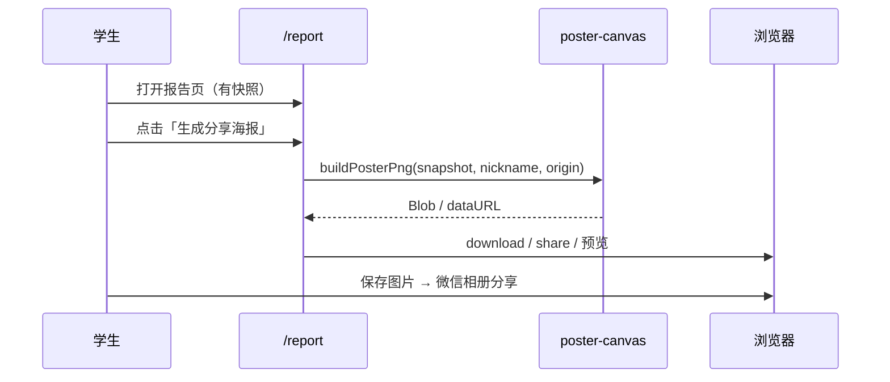

# T4.2 结果海报生成 — 设计规格

**日期**: 2026-05-17  
**范围**: Phase 4 学生端 — 在 `/report` 基于最近一次测评快照，用**客户端 Canvas** 绘制可下载 PNG 结果海报；二维码引导回站点（为 T4.3 语音彩蛋预留路径）

**依赖**: T2.5 结果报告页（`/report` + `report-storage` + `report-copy`）、T1.5 登录昵称（`getStoredNickname`）、T1.6 全站视觉（Clay + 霓虹渐变）  
**并行**: T4.1 科普图书馆、T4.4 响应式、T4.5 Admin；**不依赖** T4.1 API  
**后续消费**: T4.3 语音彩蛋可将二维码落地页从占位改为 `/voice/[type]`；T5.2 E2E 可增「生成并下载海报」路径

---

## 1. 背景与目标

### 任务书（T4.2）

**海报生成**：前端 Canvas 绘制结果海报，支持**下载** / **分享朋友圈**。

### 验收标准（PPA）

| 项       | 要求                                                            |
| -------- | --------------------------------------------------------------- |
| 绘制方式 | 前端 **Canvas**（任务书明确要求）                               |
| 海报内容 | **美观**；含**二维码**与**个人结果**（MBTI 类型等）             |
| 下载     | 可保存为 **PNG** 图片                                           |
| 分享     | 支持「朋友圈」场景（见 §2 Q4：MVP 以下载 + 移动端保存引导为主） |
| 平台     | PRD §4：iOS Safari / Android Chrome 均可正常下载图片            |

### 产品范围（PRD §1.4）

- **包含（MVP）**: 精灵视觉、昵称（若有）、人格四字母代码、站点二维码、品牌/免责声明短句、从报告页一键生成。
- **排除（本任务）**: T4.3 语音播放页与 TTS/预录音频、服务端海报渲染、海报模板 CMS、微信 JS-SDK 直接发朋友圈、雷达图完整复刻（可简化为四维条形或省略）。

### 现状勘察（2026-05-17）

| 层级                               | 状态                                                                   |
| ---------------------------------- | ---------------------------------------------------------------------- |
| `apps/web/src/app/report/page.tsx` | 已有报告 Hero、精灵卡、雷达图、解析卡；**无**海报入口                  |
| `report-storage.ts`                | `localStorage` 快照：`mode`、`result.mbti_type`、`result.scores`       |
| `sprite-profile-card.tsx`          | 精灵为 **SVG 渐变圆** + 文案映射（E→曦光，I→月影）；**无**位图精灵资源 |
| `auth-token.ts`                    | 登录后存 `ppa_user_nickname`；游客无昵称                               |
| `apps/web/package.json`            | **无** `html2canvas` / `qrcode` 依赖                                   |
| `PPA_Tech_SPEC.md` §3.4            | 建议 html2canvas **或**原生 Canvas；注意 SSR 与跨域图                  |
| `apps/api`                         | **无** 海报相关端点（MVP 不需要）                                      |
| `prisma`                           | `TestResult` 已存在；海报 **不读库**，仅用本地快照（与当前报告页一致） |

**结论**: T4.2 为**纯前端切片**：Canvas 合成器 + 报告页 UI 入口 + Vitest 纯函数 + 可选 Playwright smoke；模式对齐 T3.4「在既有页面上验收级增强」。

---

## 2. 假设与待确认项

| ID  | 假设（本 spec 采用）                                                                                                       | 若需变更                        |
| --- | -------------------------------------------------------------------------------------------------------------------------- | ------------------------------- |
| Q1  | 海报数据源 = `loadReportSnapshot()`；无快照时按钮禁用并提示先完成测评                                                      | 登录用户改拉服务端 `TestResult` |
| Q2  | 昵称：已登录用 `getStoredNickname()`；游客显示 **「星球探索者」**（不收集真实姓名）                                        | 游客不显示昵称行                |
| Q3  | 二维码内容 = `{origin}/?from=poster&ref={mbti_type}`（`origin` 优先 `NEXT_PUBLIC_APP_URL`，否则 `window.location.origin`） | 固定生产域名；或 per-user 短链  |
| Q4  | 「分享朋友圈」MVP = **下载 PNG** + 文案提示「保存后到微信相册分享」；支持环境则启用 **`navigator.share` 传文件**（非必达） | 仅桌面下载                      |
| Q5  | 画布实现 = **原生 Canvas 2D 绘制**（见 §3 方案 A）；固定导出 **2×** 像素比保证清晰                                         | 改用 html2canvas 抓 DOM         |
| Q6  | 版式 = **竖版 9:16**（逻辑 1080×1920），适配手机保存                                                                       | 1:1 方图                        |
| Q7  | 精灵视觉 = Canvas 绘制渐变圆 + 星形路径（与报告页语义一致）；**不**引入新图片资源（避免 CORS）                             | 使用 `public/sprites/*.png`     |
| Q8  | 海报在 **客户端组件**内生成；`dynamic import` 二维码库，避免 SSR 报错                                                      | 服务端生成                      |

---

## 3. 方案对比

| 方案                                 | 说明                                            | 优点                                                                  | 缺点                                              | 结论     |
| ------------------------------------ | ----------------------------------------------- | --------------------------------------------------------------------- | ------------------------------------------------- | -------- |
| **A. 原生 Canvas 2D 合成器（推荐）** | `lib/poster-canvas.ts` 按布局绘制背景、文字、QR | 导出稳定；iOS 下载路径清晰；无 DOM/CORS 坑；符合任务书「Canvas 绘制」 | 需维护布局常量；与页面样式需手动对齐              | **采用** |
| B. 隐藏 DOM + html2canvas            | 复用 React 海报组件截图                         | 视觉与页面一致快                                                      | 体积大；字体/跨域图易失败；移动端偶发空白         | 不采用   |
| C. Nest 服务端 Puppeteer/Sharp       | 后端出图                                        | 样式统一、可缓存                                                      | 超 MVP；需存储与鉴权；与任务书「前端 Canvas」不符 | 不采用   |

### 3.1 与 T4.1 边界

| 维度     | T4.1 科普图书馆                      | T4.2 结果海报                    |
| -------- | ------------------------------------ | -------------------------------- |
| 路由     | `/library`、`/library/[slug]`        | `/report`（入口挂载，无新路由）  |
| 后端     | `LibraryModule` 公开 API             | **无** 新 API                    |
| 数据     | `LibraryArticle` 表                  | `ReportSnapshot`（localStorage） |
| 用户路径 | 浏览科普文章                         | 测评完成 → 报告 → 生成海报       |
| 并行关系 | 互不阻塞；共用 SiteHeader/主题 token |                                  |

### 3.2 与 T4.3 / T4.x 边界

| 任务              | 关系                                                                            |
| ----------------- | ------------------------------------------------------------------------------- |
| **T4.3 语音彩蛋** | 二维码落地页 MVP 为首页带 query；T4.3 可改为 `/voice/[type]` 而不改 Canvas 管线 |
| **T4.4 响应式**   | 海报弹层/按钮在 375px 需可点；导出尺寸固定，不依赖视口                          |
| **T4.5–T4.8 CMS** | 无依赖；海报文案走本地 `report-copy` / 常量                                     |

---

## 4. 功能设计

### 4.1 用户流程



### 4.2 海报版式（逻辑 1080×1920，竖版）

| 区域   | 内容                                                                   |
| ------ | ---------------------------------------------------------------------- |
| 顶栏   | 品牌：「性格星球：觉醒计划」+ 副标题「我的 MBTI 探索卡」               |
| 主视觉 | 渐变背景 blob；精灵圆（紫渐变 + 星形）；`{MBTI}` 超大字（如 INFP）     |
| 信息区 | 精灵称号（曦光/月影）；`report-copy` 一句 summary（截断 ≤40 字）       |
| 昵称行 | `{nickname}` · 完成于 `{date}`（快照 `generated_at` 格式化为本地日期） |
| 底栏   | 二维码（≥160×160 逻辑 px）+ 「扫码探索你的星球」                       |
| 脚注   | 「娱乐参考，非医疗诊断」                                               |

配色复用 CSS 变量近似值（Canvas 内写死 hex，与 `--primary` / `--chart-*` 对齐，深色海报固定为**深色底 + 浅色字**以保证分享对比度）。

### 4.3 模块划分

| 文件                                   | 职责                                                                          |
| -------------------------------------- | ----------------------------------------------------------------------------- |
| `lib/poster-types.ts`                  | `PosterInput`、`PosterLayout` 类型                                            |
| `lib/poster-layout.ts`                 | 常量：宽高、边距、字体阶梯、截断规则                                          |
| `lib/poster-sprite.ts`                 | `pickSpriteLabel(mbtiType)`（与 `sprite-profile-card` 规则一致）              |
| `lib/poster-qr.ts`                     | `buildPosterShareUrl(origin, mbtiType)`                                       |
| `lib/poster-canvas.ts`                 | `renderPosterToCanvas(input) -> HTMLCanvasElement`；`canvasToPngBlob(canvas)` |
| `lib/poster-download.ts`               | `downloadBlob(blob, filename)`；`sharePosterBlob(blob)`（feature detect）     |
| `components/report/poster-actions.tsx` | 按钮、加载态、错误提示、可选预览 ``                                      |
| `app/report/page.tsx`                  | 挂载 `PosterActions`（仅 `snapshot` 存在时）                                  |

### 4.4 下载与分享语义

- **下载文件名**: `ppa-poster-{mbti_type}-{yyyyMMdd}.png`
- **iOS**: 使用 `<a download>` + `blob:` URL；若 Safari 忽略 download 属性，fallback 打开新标签显示图片并提示长按保存（UI 文案）。
- **Web Share Level 2**（可选）: `navigator.canShare({ files })` 时分享 `File`；失败静默回退下载。

### 4.5 错误处理

| 场景          | 行为                                                   |
| ------------- | ------------------------------------------------------ |
| 无快照        | 不展示海报区（与现报告空态一致）                       |
| Canvas 不支持 | 按钮禁用 + 「当前浏览器不支持海报生成」                |
| 生成异常      | Toast/行内错误「海报生成失败，请重试」；不抛未捕获异常 |
| 极长昵称      | 超 16 字截断省略号                                     |

---

## 5. 测试策略（对齐 PPA §5.3 T4.x）

| 层级               | 内容                                                                                                                                                                            |
| ------------------ | ------------------------------------------------------------------------------------------------------------------------------------------------------------------------------- |
| **Vitest 单元**    | `buildPosterShareUrl`、`pickSpriteLabel`、`truncateSummary`、布局常量；mock canvas 时测 `renderPosterToCanvas` 不抛错（jsdom 无 Canvas 时用 `vitest-canvas-mock` 或仅测纯函数） |
| **集成**           | 无后端 API                                                                                                                                                                      |
| **E2E（可选 P1）** | 标准模式完成 → 报告页 → 点击生成 → 断言出现「下载海报」或 preview；不断言二进制 PNG                                                                                             |

门禁：变更后 `pnpm test:gate`；涉及 UI 加 `pnpm test:e2e e2e/report-poster.spec.ts`（可选）。

---

## 6. 依赖与环境

| 包                                | 用途                      |
| --------------------------------- | ------------------------- |
| `qrcode`（或 `qrcode-generator`） | 生成 QR 矩阵绘制到 Canvas |
| （可选）`vitest-canvas-mock`      | 单测环境 Canvas 2D        |

`.env.example` 增补（可选）:

```bash
# 海报二维码使用的站点根 URL（生产填 https://your-domain）
NEXT_PUBLIC_APP_URL=http://127.0.0.1:3000
```

---

## 7. 明确排除

- 服务端存储海报、海报历史列表
- 微信 Open Tag / 小程序分享
- T4.3 音频页实现
- 在海报上绘制 Recharts 雷达图（复杂度高，MVP 省略）
- PRD 图书馆互动小测 / 徽章

---

## 8. Spec 自检

- [x] 与任务书 T4.2 验收一致（Canvas、二维码、个人结果、下载）
- [x] 与 PRD §1.4 海报要素对齐（精灵、昵称、类型、二维码）
- [x] 与 `PPA_Tech_SPEC.md` §3.4 客户端生成一致
- [x] 与 T4.1 边界清晰（无路由/API 冲突）
- [x] 无 TBD；Q1–Q8 默认明确
- [x] 范围适合单份实施计划

---

## 9. 待用户批准项（进入阶段 C 前）

请确认 HTML 审阅页选型（默认）：

- **C-A** 原生 Canvas 合成器
- **L-A** 竖版 9:16
- **Q-A** 二维码 → `/?from=poster&ref={type}`（T4.3 可改落地）
- **N-A** 游客昵称「星球探索者」

批准句式示例：**批准 T4.2，Canvas C-A，版式 L-A，二维码 Q-A，昵称 N-A**
