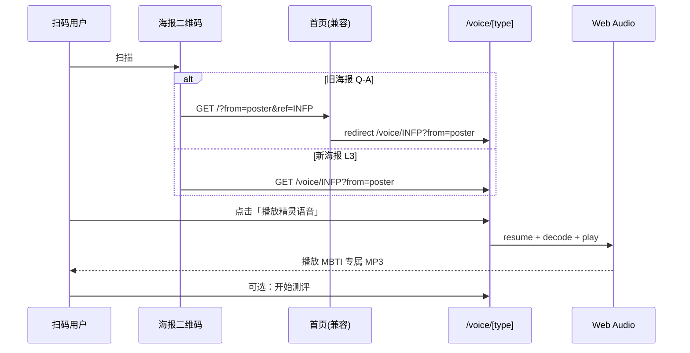

# T4.3 语音彩蛋 — 设计规格

**日期**: 2026-05-17  
**范围**: Phase 4 学生端 — 海报二维码落地 H5 页，用 **Web Audio API** 播放对应 MBTI 类型的专属语音；兼容 T4.2 已发出的 `/?from=poster&ref={type}` 链接

**依赖**: T4.2 海报二维码（`buildPosterShareUrl` → Q-A）、T2.5 `report-copy`（16 型文案）、T1.6 全站视觉（Clay + 霓虹）、`media-preload.ts`（HTMLAudio 预加载，本任务改用 Web Audio 播放管线）  
**并行**: T4.1 图书馆、T4.4 响应式；**不依赖** T4.5–T4.8 CMS  
**后续消费**: T4.2 更新 `poster-qr.ts` 指向 `/voice/{type}`；T5.2 E2E 可增「扫码语音彩蛋」路径

---

## 1. 背景与目标

### 任务书（T4.3）

**语音彩蛋**：集成 **Web Audio API**，实现**特定结果**触发**专属语音**。

### 验收标准（PPA）

| 项       | 要求                                                         |
| -------- | ------------------------------------------------------------ |
| API      | 使用 **Web Audio API**（`AudioContext` + `decodeAudioData`） |
| 触发条件 | 扫描海报二维码或访问带类型的语音页，播放**该 MBTI 类型**音频 |
| 体验     | **播放流畅**；主流移动浏览器无阻塞性兼容问题                 |
| 优先级   | P2（在 T4.2 海报链路之后交付）                               |

### 产品范围（PRD §1.4）

- **包含（MVP）**: 扫描二维码 → H5 页 → 播放该人格的**预录制音频**（PRD 亦允许 TTS，MVP **优先预录制**）。
- **排除（本任务）**: 语音 CMS / 后台上传、服务端转码、微信内 JS-SDK 分享、登录鉴权、根据用户历史动态选音、Web Speech **作为主路径**（仅可作缺失资源时的可选降级，默认关闭）。

### 现状勘察（2026-05-17）

| 层级                            | 状态                                                                               |
| ------------------------------- | ---------------------------------------------------------------------------------- |
| `apps/web/src/app/page.tsx`     | 首页 **无** `useSearchParams`；**不处理** `from=poster&ref=`                       |
| `apps/web/src/lib/poster-qr.ts` | 已实现 Q-A：`{origin}/?from=poster&ref={MBTI}`；注释写明 T4.3 可改 `/voice/[type]` |
| `apps/web/src/app/`             | **无** `/voice` 路由                                                               |
| `apps/web/public/`              | 仓库内 **无** `audio/` 静态资源（Tech SPEC 目录预留 `public` audio）               |
| `report-copy.ts`                | 16 型 `summary` 等文案，可作页面副文案/字幕，**非**音频源                          |
| `media-preload.ts`              | `preloadAudio` 基于 `HTMLAudioElement`；AVG 用，**不**满足任务书 Web Audio 要求    |
| `poster-canvas.ts`              | 二维码已嵌入 Q-A URL；T4.3 实施后需 **同步改** `buildPosterShareUrl`               |
| `apps/api`                      | **无** 语音相关端点（MVP 不需要）                                                  |
| `PPA_Tech_SPEC.md`              | §2 目录含 `public/audio`；**无** 语音专节；本 spec 补播放契约                      |

**结论**: T4.3 为**纯前端切片**：语音落地页 + Web Audio 播放库 + 静态 MP3 资源约定 + 首页 query 兼容重定向 + 更新海报 QR URL + Vitest + 可选 Playwright。

---

## 2. 假设与待确认项

| ID  | 假设（本 spec 采用）                                                                                                                       | 若需变更                       |
| --- | ------------------------------------------------------------------------------------------------------------------------------------------ | ------------------------------ |
| L1  | **落地路由** = `/voice/[type]`（`type` 四字母大写，非法 → 404 或友好降级页）                                                               | 仅首页 query，无独立路由       |
| L2  | **向后兼容**：访问 `/?from=poster&ref={type}` 时 **客户端重定向** 至 `/voice/{type}?from=poster`（保留追踪参数）                           | 在首页内嵌播放器、不跳转       |
| L3  | **海报 QR（实施后）** = `{origin}/voice/{type}?from=poster`；`buildPosterShareUrl` 与单测同步更新                                          | 继续 Q-A 首页 query            |
| A1  | **音频源** = `public/audio/voice/{MBTI}.mp3`（16 个文件）；MVP 可用**短占位音**（运营后续替换），文件缺失时显示文案 + 重试，**不**默认 TTS | 仅 2 条精灵音（E/I）+ 通用文案 |
| A2  | **播放实现** = `fetch` → `ArrayBuffer` → `audioContext.decodeAudioData` → `AudioBufferSourceNode` → `destination`（满足 Web Audio API）    | 仅用 `<audio>` 标签            |
| P1  | **自动播放策略**：进入页面 **不** 强行 autoplay；主按钮「播放精灵语音」；用户点击后 `AudioContext.resume()` 再播（规避 iOS 策略）          | 进入即播（易失败）             |
| P2  | 播放中展示 **类型 + 精灵称号 + report-copy 一句 summary**；播放结束可 CTA「开始测评」→ `/test/standard`                                    | 无 CTA                         |
| P3  | **无后端**、无登录要求；`from=poster` 仅用于 UI 文案（如「来自好友分享」）与日后分析，不上报服务器（MVP）                                  | 埋点 API                       |
| P4  | 资源体积：单文件目标 ≤ 500KB、16 型合计 ≤ 8MB；实施阶段可用 1–3 秒静音/蜂鸣占位                                                            | 接受更大体积                   |
| P5  | `SiteHeader` 保持；语音页为**轻量全屏卡片**，深色模式与首页 Hero 一致                                                                      | 隐藏 Header 的沉浸页           |

---

## 3. 方案对比

### 3.1 落地与路由

| 方案                                      | 说明                                           | 优点                                        | 缺点                                   | 结论     |
| ----------------------------------------- | ---------------------------------------------- | ------------------------------------------- | -------------------------------------- | -------- |
| **L-A 独立 `/voice/[type]` + query 兼容** | 新路由；首页检测 `from=poster&ref` 后 redirect | URL 语义清晰；利于分享书签；T4.2 改 QR 简单 | 多一个路由文件                         | **采用** |
| L-B 仅首页 query 内嵌播放器               | 不改 `poster-qr`                               | 零新路由                                    | 首页职责膨胀；SEO/分享 URL 含糊        | 不采用   |
| L-C Middleware 302                        | `middleware.ts` 重定向                         | 无客户端闪屏                                | 需维护规则表；与现有客户端页模式不一致 | 不采用   |

### 3.2 音频技术与资源

| 方案                                        | 说明         | 优点                       | 缺点                           | 结论     |
| ------------------------------------------- | ------------ | -------------------------- | ------------------------------ | -------- |
| **A-A Web Audio + 16×预录制 MP3（推荐）**   | 每型一文件   | 符合 PRD；任务书 Web Audio | 需 16 个资源（可占位）         | **采用** |
| A-B Web Audio + 2×精灵音 + 屏幕文案区分类型 | E/I 各一 MP3 | 资源少                     | 非「专属语音」感知弱           | 备选     |
| A-C Web Speech API TTS                      | 无静态文件   | 零资源                     | 音质/一致性差；偏离 PRD 预录制 | 不采用   |

### 3.3 播放交互

| 方案                         | 说明                      | 优点               | 缺点           | 结论     |
| ---------------------------- | ------------------------- | ------------------ | -------------- | -------- |
| **P-A 用户点击播放（推荐）** | 首次点击解锁 AudioContext | iOS/Android 兼容好 | 多一步操作     | **采用** |
| P-B 进入自动播放             | mount 即 `play()`         | 扫码即听           | 移动端常被拦截 | 不采用   |

### 3.4 与 T4.2 / T4.1 边界

| 任务     | 关系                                                                  |
| -------- | --------------------------------------------------------------------- |
| **T4.2** | 本任务**修改** `poster-qr.ts` 与 `poster-qr.spec.ts`；Canvas 绘制不变 |
| **T4.1** | 无路由冲突；语音页 CTA 可链到测评/图书馆                              |
| **T4.4** | 语音页 375px 按钮 ≥ 44px 触控区                                       |
| **T5.2** | 可选 E2E：`/voice/INFP` 与 `/?from=poster&ref=INFP` 重定向            |

---

## 4. 功能设计

### 4.1 用户流程

### 4.2 页面线框（逻辑）

| 区域     | 内容                                                                  |
| -------- | --------------------------------------------------------------------- |
| 顶区     | 精灵渐变圆 + 星形（复用报告页语义）；`{MBTI}` 大字；精灵称号          |
| 文案区   | `report-copy` 的 `title` + `summary`（截断）                          |
| 播放区   | 主按钮：播放 / 暂停 / 重播；进度条（`currentTime` / `duration` 可选） |
| 来源提示 | 若 `from=poster`：「来自好友的星球分享卡」                            |
| 底栏 CTA | 「探索我的性格」→ `/test/standard`；次要链：看板 / 科普馆             |
| 脚注     | 「娱乐参考，非医疗诊断」                                              |

### 4.3 模块划分

| 模块                                         | 职责                                                                     |
| -------------------------------------------- | ------------------------------------------------------------------------ |
| `lib/voice-types.ts`                         | `VoiceMbtiType`、路由 param 校验、`isVoiceMbtiType()`                    |
| `lib/voice-audio-path.ts`                    | `buildVoiceAudioUrl(type)` → `/audio/voice/INFP.mp3`                     |
| `lib/voice-web-audio.ts`                     | `createVoiceAudioEngine()`：load、play、stop、dispose、错误类型          |
| `lib/poster-landing.ts`                      | `parsePosterLandingQuery(searchParams)`、`buildVoicePathFromPosterRef()` |
| `components/voice/voice-player.tsx`          | 客户端 UI：状态机 idle/loading/playing/error                             |
| `components/voice/poster-query-redirect.tsx` | 首页挂载：检测 Q-A 后 `router.replace`                                   |
| `app/voice/[type]/page.tsx`                  | 动态路由页；`notFound()` 非法 type                                       |
| `app/page.tsx`                               | 仅增加 `<PosterQueryRedirect />`（客户端子树）                           |
| `public/audio/voice/*.mp3`                   | 16 型静态资源（占位 + README 说明替换方式）                              |

### 4.4 Web Audio 播放契约

1. 单例 `AudioContext`（`webkitAudioContext` 兼容）；页面卸载 `close()`。
2. `loadVoiceBuffer(url)`：`fetch` → `arrayBuffer` → `decodeAudioData`；失败抛 `VoiceAudioLoadError`。
3. `playVoiceBuffer(buffer)`：停止上一 `AudioBufferSourceNode`；`createBufferSource` → `connect(destination)` → `start(0)`；`onended` 回调。
4. 用户手势：任何 `play` 前执行 `await audioContext.resume()`。
5. **不**在 SSR 中创建 Context；页面为 `'use client'` 或子组件客户端化。

### 4.5 错误与降级

| 场景         | 行为                                                     |
| ------------ | -------------------------------------------------------- |
| 非法 `type`  | `notFound()` 或展示「未知类型」+ 链首页                  |
| MP3 404      | 错误文案 +「重试」；日志 `console.warn`（无 Sentry MVP） |
| 浏览器无 WA  | 提示升级浏览器；隐藏播放按钮                             |
| 播放中被切换 | `stop()` 后加载新 buffer（同页重播不换路由）             |

---

## 5. 测试策略

| 层级     | 内容                                                                                              |
| -------- | ------------------------------------------------------------------------------------------------- |
| Vitest   | `voice-types`、`voice-audio-path`、`poster-landing` 纯函数；`voice-web-audio` mock `AudioContext` |
| 手动     | iOS Safari / Android Chrome：扫码或输入 URL → 点击播放 → 可听完整                                 |
| 可选 E2E | `e2e/voice-poster.spec.ts`：`/?from=poster&ref=INFP` → URL 含 `/voice/INFP`                       |

门禁：`pnpm test:unit`（web）+ `pnpm test:gate`（若改 poster-qr 须全绿）。

---

## 6. 明确排除

- Nest 语音 API、CDN 签名 URL、用户上传录音
- 微信内「分享给好友」能力
- 修改 `report-copy` 结构（仅读取）
- T4.8 CMS 管理语音文案
- 在 AVG 剧情中接入同一播放器（可后续复用 `voice-web-audio.ts`）

---

## 7. Spec 自检

- [x] 与任务书 T4.3 验收一致（Web Audio、特定类型、播放体验）
- [x] 与 PRD §1.4 扫码 → H5 播放对齐
- [x] 与 T4.2 Q-A 兼容及 L3 升级路径明确
- [x] 与 T4.1 无 API/路由冲突
- [x] 无 TBD；L1–P5 默认明确
- [x] 范围适合单份实施计划

---

## 8. 待用户批准项（进入阶段 C 前）

请确认 HTML 审阅页选型（默认）：

- **L-A** 独立 `/voice/[type]` + 首页 Q-A 重定向
- **A-A** Web Audio + 16×预录制 MP3
- **P-A** 用户点击播放（非自动播）
- **L3** 新海报 QR → `/voice/{type}?from=poster`

批准句式示例：**批准 T4.3，落地 L-A，音频 A-A，交互 P-A，二维码 L3**
