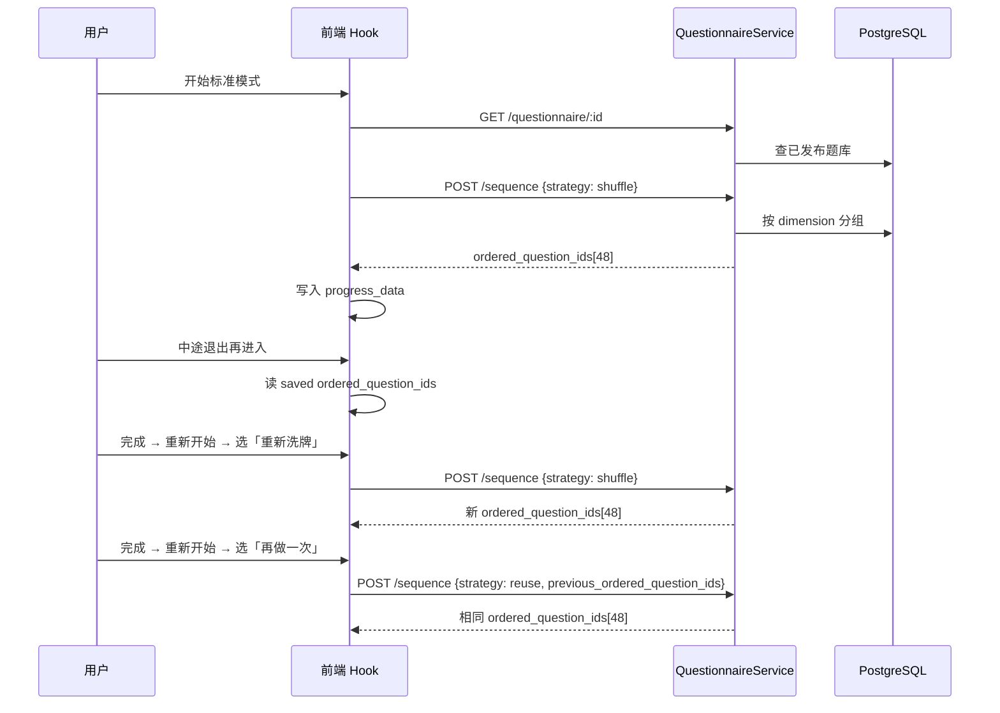

# 标准模式随机 48 题抽题 — 设计规格

**日期**: 2026-05-24  
**范围**: 替换 T2.7 自适应 MVP，实现从大题库分层随机抽取 48 题用于标准模式测评  
**方案**: 改造现有 `POST /questionnaire/:id/sequence` 端点  
**依赖**: T2.7 问卷 API、TemporarySession 进度契约、`StandardQuestion.dimension` 字段

---

## 1. 背景与目标

### 1.1 需求摘要

| 决策项         | 结论                                               |
| -------------- | -------------------------------------------------- |
| 与 T2.7 自适应 | **完全替换**（移除 screening → follow-up 逻辑）    |
| 呈现题数       | 固定 **48 题**                                     |
| 维度分配       | 每维度（EI/SN/TF/JP）**12 题**，分层无放回随机     |
| 题序           | 四维度合并后 **Fisher-Yates 全局洗牌**             |
| 重新开始       | 用户可选：**重新洗牌** 或 **沿用上次题序再做一次** |
| 题池不足       | **硬失败**（HTTP 400），提示运维补题               |

### 1.2 场景示例

运维配置 96 题大题库（每维度 24 题），用户开始标准模式时，服务端从每维度随机抽 12 题，合并 48 题后洗牌，写入 `progress_data.standard.ordered_question_ids`。续答时题序不变。

### 1.3 验收标准

| ID   | 标准                                                                      |
| ---- | ------------------------------------------------------------------------- |
| AC-1 | 新会话 `POST /sequence` 返回 **恰好 48 题**，每维度 **12 题**，无重复 ID  |
| AC-2 | 48 题题序经全局洗牌，非按维度分组呈现                                     |
| AC-3 | 某维度题池 < 12 时返回 **400 + insufficient_questions**，含维度与可用数量 |
| AC-4 | 续答（已有 progress）**不重新抽题**，沿用 saved `ordered_question_ids`    |
| AC-5 | 重新开始选「重新洗牌」→ 新题序；选「再做一次」→ 原题序、答案清空          |
| AC-6 | 前端移除筛选轮扩展逻辑（`screeningExtending` 等）                         |
| AC-7 | Seed 题库扩展至每维度 ≥ 12 题，现有单测/E2E 更新并通过 `pnpm test:gate`   |

---

## 2. 方案选择

### 2.1 候选方案

| 方案          | 描述                                    | 评价                              |
| ------------- | --------------------------------------- | --------------------------------- |
| **A（采用）** | 改造 `POST /questionnaire/:id/sequence` | 最小 API 变更，复用 progress 契约 |
| B             | 新增 `POST /questionnaire/:id/draw`     | 语义清晰但多一个端点，收益有限    |
| C             | 前端本地随机                            | 题池暴露、续答不一致 — **否决**   |

### 2.2 不修改的范围

- `GET /questionnaire/:id` 仍返回**全量已发布题库**（客户端用 `questionsMap` lookup）
- `progress_data` JSON 契约不变（`ordered_question_ids` 字段语义保持）
- MBTI 计分逻辑不变（基于 `ordered_question_ids` + `answers`）
- `groupTag` DB 字段保留，**抽题逻辑不再读取**

---

## 3. 后端设计

### 3.1 常量

```typescript
const PRESENTED_COUNT = 48;
const PER_DIMENSION_COUNT = 12; // PRESENTED_COUNT / 4
const DIMENSIONS = ['EI', 'SN', 'TF', 'JP'] as const;
```

### 3.2 抽题算法

```
generateRandomQuestionIds(questionnaireId, options):
  1. 查询 questionnaire 下全部题目（含 options），按 dimension 分组
  2. 对每个 dimension ∈ DIMENSIONS:
       if count(questions[dimension]) < PER_DIMENSION_COUNT:
         throw BadRequestException('insufficient_questions', { dimension, required, available })
  3. if options.strategy === 'reuse' && options.previous_ordered_question_ids:
       a. 校验 previous_ids 长度 === 48
       b. 校验每个 ID 存在于当前已发布题库
       c. 校验每维度恰好 12 题（防止题库变更后维度失衡）
       d. 返回 previous_ids（顺序不变）
  4. else (strategy === 'shuffle' 或默认):
       a. 每维度: shuffle(pool) → take(PER_DIMENSION_COUNT)
       b. 合并 48 IDs
       c. Fisher-Yates 全局洗牌
       d. 返回 ordered_question_ids
```

### 3.3 API 契约

**`POST /questionnaire/:id/sequence`**

请求体（`GenerateSequenceDto`）：

| 字段                            | 类型                   |     必填     | 说明             |
| ------------------------------- | ---------------------- | :----------: | ---------------- |
| `strategy`                      | `'shuffle' \| 'reuse'` |      否      | 默认 `'shuffle'` |
| `previous_ordered_question_ids` | `string[]`             | reuse 时必填 | 上次会话题序     |

移除字段：`answers`（自适应已废弃）

成功响应（不变）：

```json
{
  "success": true,
  "data": {
    "questionnaire_id": "...",
    "ordered_question_ids": ["...", "..."]
  },
  "message": "ok"
}
```

失败响应（题池不足）：

```json
{
  "success": false,
  "message": "insufficient_questions",
  "data": {
    "dimension": "EI",
    "required": 12,
    "available": 8
  }
}
```

### 3.4 随机性

- 使用 Node.js `crypto.randomInt` 实现 Fisher-Yates 洗牌
- 单元测试通过 mock 随机源或固定 seed 注入保证可重复断言

### 3.5 删除的代码

- `QuestionnaireService` 中：`extractSignals`、`findWeakDimensions`、`WEAK_SIGNAL_THRESHOLD`、`TARGET_COUNT=12` 自适应逻辑
- `screening` / `followups` / `groupTag` 分组抽题路径

---

## 4. 前端设计

### 4.1 Hook 变更（`use-adaptive-standard-test.ts`）

| 变更 | 说明                                                                                                              |
| ---- | ----------------------------------------------------------------------------------------------------------------- |
| 删除 | `SCREENING_COUNT`、`screeningExtending`、`screeningExtendedRef`、`extendingInProgressRef`、筛选轮扩展 `useEffect` |
| 修改 | 首次无 progress 时 `fetchQuestionSequence(id, { strategy: 'shuffle' })`                                           |
| 修改 | `restart(strategy: 'shuffle' \| 'reuse')` — reuse 时传入当前 `ordered_question_ids`                               |
| 可选 | 重命名文件为 `use-random-standard-test.ts` 并更新 import                                                          |

### 4.2 API 客户端（`questionnaire-api.ts`）

```typescript
export type SequenceStrategy = 'shuffle' | 'reuse';

export async function fetchQuestionSequence(
  id: string,
  options?: {
    strategy?: SequenceStrategy;
    previousOrderedQuestionIds?: string[];
  },
): Promise<ApiSequenceData>;
```

移除 `answers` 参数。

### 4.3 重新开始 UI（`standard-test-client.tsx`）

完成页「重新开始」按钮改为弹出选择对话框（Shadcn `AlertDialog` 或等效组件）：

| 选项     | 文案建议             | 行为                 |
| -------- | -------------------- | -------------------- |
| 重新洗牌 | 「换一批新题目」     | `restart('shuffle')` |
| 再做一次 | 「相同题目再做一次」 | `restart('reuse')`   |
| 取消     | —                    | 关闭对话框           |

题池不足错误：在 loading/error 阶段展示友好提示（「题库配置不足，请联系管理员」）。

### 4.4 问卷 ID

- 扩展 seed 数据或新增 `standard-v1` 问卷（每维度 ≥ 12 题，建议 96 题验证随机性）
- `standard-test-client.tsx` 中 `QUESTIONNAIRE_ID` 切换至新问卷

---

## 5. 数据流



---

## 6. 测试策略

### 6.1 后端单元测试（`questionnaire.service.spec.ts`）

| 用例           | 断言                                     |
| -------------- | ---------------------------------------- |
| 正常抽题       | 返回 48 题，每维度 12 题，无重复         |
| 全局洗牌       | 题序不等于「维度块顺序」                 |
| 题池不足       | 某维度 < 12 → 400 insufficient_questions |
| reuse 合法     | 返回相同题序                             |
| reuse 非法     | ID 不存在 / 长度非 48 / 维度失衡 → 400   |
| 删除自适应用例 | 移除 screening/follow-up 相关测试        |

### 6.2 集成测试

- 更新 `golden-path-helpers.ts` 中 adaptive sequence 调用
- 新增或更新 questionnaire E2E smoke

### 6.3 前端单测

- 更新 `questionnaire-api.spec.ts`（新 DTO）
- 更新 hook 测试（无 screening 扩展）
- 更新 `standard-test-client.hooks-order.spec.tsx`

### 6.4 E2E

- 更新 `e2e/helpers/adaptive-standard-seed.ts`（重命名或扩展为 random-standard-seed）
- 更新 `standard-restart-after-complete.spec.ts`（两种 restart 策略）

---

## 7. 迁移与兼容

| 项                                   | 处理                                                           |
| ------------------------------------ | -------------------------------------------------------------- |
| 进行中会话（旧 12 题 adaptive 进度） | MVP 可接受：旧 progress 续答仍用 saved ids；新开始走 48 题逻辑 |
| `adaptive-demo-v1` seed              | 扩展至 96 题或新增问卷 ID，更新引用                            |
| T2.7 文档                            | 更新 `docs/T2.7-人工验收清单.md` 相关条目（后续任务）          |

---

## 8. 文件变更清单（预估）

| 文件                                                       | 变更类型            |
| ---------------------------------------------------------- | ------------------- |
| `apps/api/src/questionnaire/questionnaire.service.ts`      | 重写抽题逻辑        |
| `apps/api/src/questionnaire/questionnaire.service.spec.ts` | 替换测试用例        |
| `apps/api/src/questionnaire/dto/generate-sequence.dto.ts`  | 新 DTO 字段         |
| `apps/api/src/questionnaire/questionnaire.controller.ts`   | 更新 Swagger 注释   |
| `apps/web/src/lib/questionnaire-api.ts`                    | 新 options 参数     |
| `apps/web/src/lib/questionnaire-api.spec.ts`               | 更新                |
| `apps/web/src/hooks/use-adaptive-standard-test.ts`         | 简化 + restart 策略 |
| `apps/web/src/app/test/standard/standard-test-client.tsx`  | 重新开始对话框      |
| `prisma/seed.ts`（或等价 seed）                            | 扩展题库            |
| `e2e/helpers/adaptive-standard-seed.ts`                    | 更新                |
| `apps/api/test/helpers/golden-path-helpers.ts`             | 更新                |

---

## 9. 自检记录

- [x] 无 TBD / TODO 占位
- [x] 架构与 API、前端、测试章节一致
- [x] 范围聚焦单特性（随机 48 题），无过度设计
- [x] `reuse` 校验规则已明确（48 题 + ID 存在 + 每维度 12 题）
- [x] 与 PRD `ordered_question_ids` 续答契约兼容
